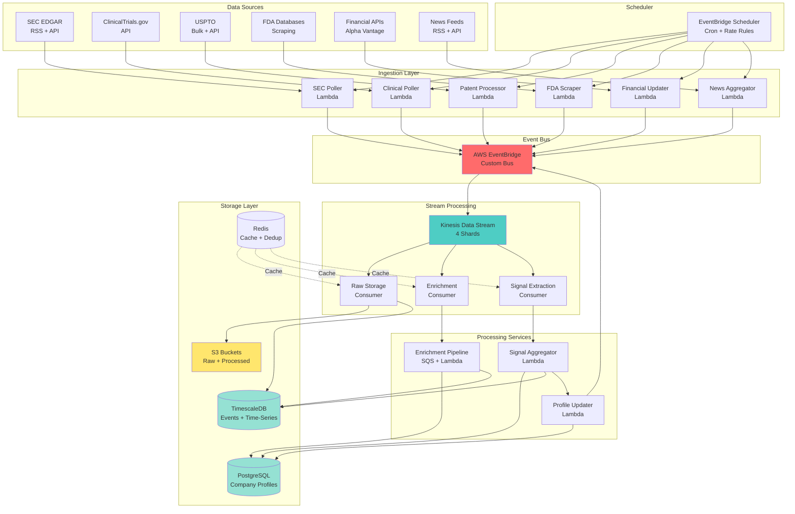
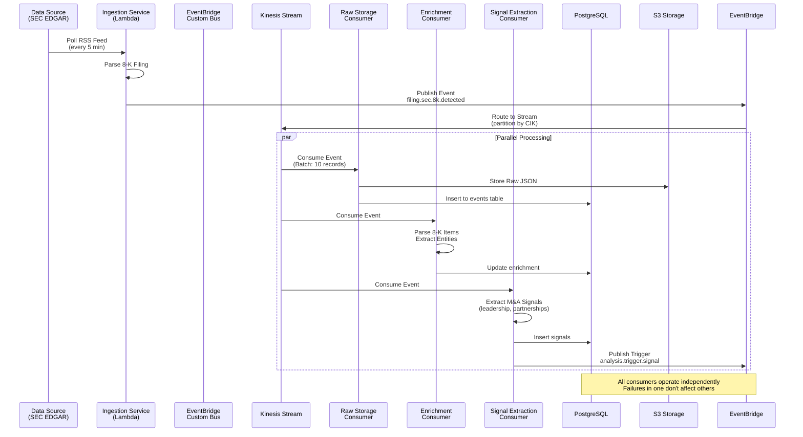
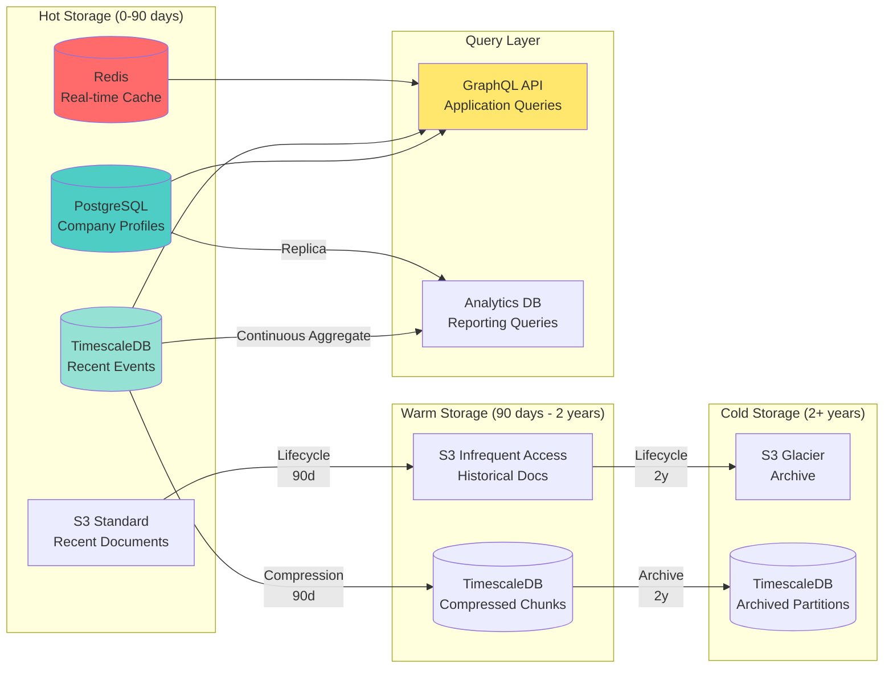
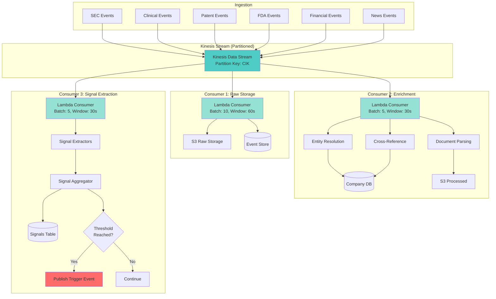
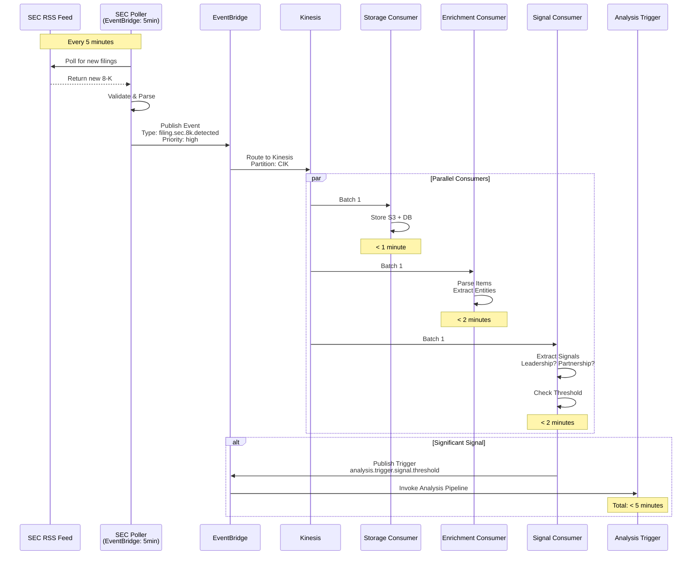
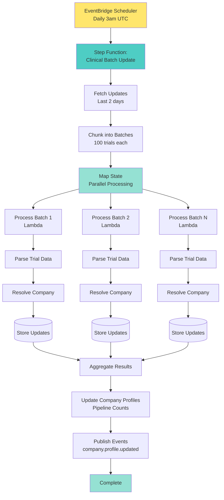
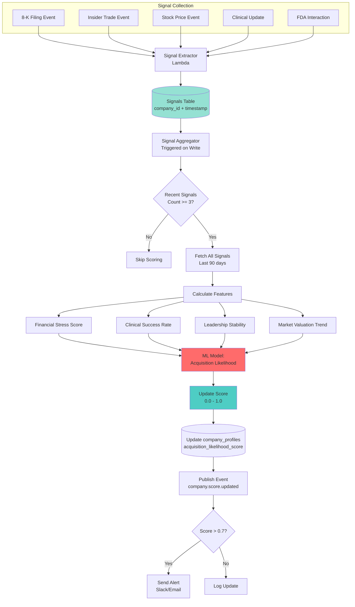

# Data Pipeline Architecture Specification
## Biotech M&A Predictor System

**Version:** 1.0
**Last Updated:** 2025-12-07
**Status:** Draft

---

## Table of Contents
1. [Overview](#overview)
2. [Data Sources & Ingestion Strategy](#data-sources--ingestion-strategy)
3. [Event Bus Architecture](#event-bus-architecture)
4. [Data Storage Strategy](#data-storage-strategy)
5. [Processing Pipeline](#processing-pipeline)
6. [Scheduler Design](#scheduler-design)
7. [System Architecture Diagrams](#system-architecture-diagrams)
8. [Data Flow & Processing Patterns](#data-flow--processing-patterns)
9. [Error Handling & Resilience](#error-handling--resilience)
10. [Monitoring & Observability](#monitoring--observability)
11. [Scalability Considerations](#scalability-considerations)
12. [Security & Compliance](#security--compliance)

---

## Overview

### System Purpose
The data pipeline ingests, processes, and enriches biotech company data from multiple heterogeneous sources to power M&A prediction models. The system operates in real-time with continuous data ingestion, event-driven processing, and scheduled batch enrichment.

### Architecture Principles
- **Event-Driven:** All data changes trigger events for downstream processing
- **Decoupled:** Services communicate via message bus, not direct calls
- **Idempotent:** All processors handle duplicate messages gracefully
- **Scalable:** Horizontal scaling of all processing components
- **Resilient:** Automatic retries, dead letter queues, circuit breakers
- **Observable:** Comprehensive logging, metrics, and tracing

### Key Requirements
- **Latency:** Critical signals (e.g., 8-K filings) processed within 5 minutes
- **Throughput:** Handle 10,000+ events/hour during peak filing periods
- **Availability:** 99.9% uptime for ingestion services
- **Data Freshness:** Company profiles updated within 15 minutes of new data
- **Retention:** Raw data retained for 7 years (regulatory compliance)

---

## Data Sources & Ingestion Strategy

### 1. SEC EDGAR (Securities Filings)

#### Data Types
- **10-K:** Annual reports (financial statements, risk factors, business overview)
- **10-Q:** Quarterly reports (financial updates, MD&A)
- **8-K:** Current reports (material events, acquisitions, leadership changes)
- **Form 4:** Insider trading reports (executive buy/sell activity)
- **13F:** Institutional holdings (quarterly positions of large investors)
- **SC 13D/G:** Beneficial ownership (5%+ stake acquisitions)

#### Ingestion Strategy
```yaml
source: SEC EDGAR RSS Feeds + API
method: Hybrid (RSS polling + direct API queries)
frequency:
  8-K: Every 5 minutes (critical real-time signal)
  Form 4: Every 15 minutes
  10-Q/10-K: Every 30 minutes
  13F: Daily (quarterly filings)
technology:
  - RSS feed parser (feedparser library)
  - SEC EDGAR REST API v2
  - Rate limiting: 10 requests/second (SEC requirement)
storage:
  - Raw XML/HTML: S3 bucket (s3://biotech-ma/sec-filings/raw/)
  - Extracted text: S3 bucket (s3://biotech-ma/sec-filings/extracted/)
  - Metadata: PostgreSQL (filing_index table)
processing:
  - Parse XBRL financial data
  - Extract text sections (Business, Risk Factors, MD&A)
  - NER for company mentions, drug names, technology terms
  - Sentiment analysis on MD&A sections
```

**Rate Limiting & Backoff:**
- Implement exponential backoff for 429 responses
- Use SEC User-Agent header: `Company Name support@company.com`
- Queue requests to respect 10/sec limit

**Key Signals Extracted:**
- Financial metrics (revenue, R&D spend, cash position, burn rate)
- Clinical trial outcomes mentioned in filings
- Strategic partnerships announced
- Leadership changes (CEO, CFO, CSO turnover)
- Litigation/regulatory issues
- Asset sales or divestitures

---

### 2. ClinicalTrials.gov API

#### Data Types
- Study records (NCT numbers, phase, status, enrollment)
- Study results (primary/secondary endpoints, adverse events)
- Protocol updates (status changes, enrollment modifications)
- Sponsor information (company, collaborators)

#### Ingestion Strategy
```yaml
source: ClinicalTrials.gov API v2
method: Incremental sync with change detection
frequency:
  - Full refresh: Weekly (Sunday 2am UTC)
  - Incremental: Daily (last_update_posted filter)
  - Critical updates: Real-time via RSS feed
technology:
  - REST API (JSON format)
  - GraphQL queries for complex filtering
rate_limits:
  - No official limit, but use 2 requests/second
storage:
  - Raw JSON: S3 (s3://biotech-ma/clinical-trials/raw/)
  - Structured: PostgreSQL (clinical_trials table)
processing:
  - Normalize sponsor names (fuzzy matching to company_profiles)
  - Calculate trial success rates by company/indication
  - Identify phase transitions (Phase 2 → 3 = positive signal)
  - Track enrollment velocity (slow enrollment = risk)
```

**Key Signals Extracted:**
- Phase progression (especially Phase 2→3 transitions)
- Trial failures/terminations (major negative signal)
- Enrollment milestones reached
- Results publication (positive/negative outcomes)
- New trial initiations (pipeline expansion)
- Collaboration patterns (co-sponsors, funders)

---

### 3. USPTO Patent Database

#### Data Types
- Patent grants (full-text, claims, assignees)
- Patent applications (published applications, continuations)
- Assignment records (ownership transfers)
- Patent citations (prior art, forward citations)

#### Ingestion Strategy
```yaml
source: USPTO Bulk Data + PatentsView API
method: Hybrid (bulk downloads + API enrichment)
frequency:
  - Bulk grants: Weekly (Tuesday releases)
  - Bulk applications: Weekly (Thursday releases)
  - Assignment records: Daily
  - API enrichment: On-demand for tracked companies
technology:
  - Bulk XML parser (PatFT format)
  - PatentsView REST API
  - Full-text search (Elasticsearch)
storage:
  - Raw XML: S3 (s3://biotech-ma/patents/raw/)
  - Extracted data: PostgreSQL (patents table)
  - Full-text index: Elasticsearch cluster
processing:
  - Parse claims and identify key technology areas
  - Map assignees to company profiles (entity resolution)
  - Build citation graphs (PageRank for patent importance)
  - Track assignment events (IP acquisition/divestiture)
```

**Key Signals Extracted:**
- Patent grant velocity (innovation rate)
- Patent quality (citation count, claim breadth)
- Technology area shifts (diversification or focus)
- IP acquisition activity (buying/selling patents)
- Exclusive licensing deals (revealed via assignments)
- Inventor mobility (key inventors leaving company)

---

### 4. FDA Databases

#### Data Sources
- **Drugs@FDA:** Approval letters, labeling, review documents
- **Purple Book:** Biologics licenses (BLA approvals)
- **FAERS:** Adverse event reports (safety signals)
- **Warning Letters:** Compliance issues, manufacturing problems
- **Breakthrough Therapy Designations:** Fast-track programs
- **Orphan Drug Designations:** Rare disease therapies

#### Ingestion Strategy
```yaml
source: Multiple FDA databases (no unified API)
method: Web scraping + RSS feeds + manual downloads
frequency:
  - Approval letters: Daily (high priority)
  - Warning letters: Daily
  - FAERS: Quarterly (bulk download)
  - Designations: Weekly
technology:
  - Scrapy framework for structured scraping
  - BeautifulSoup for HTML parsing
  - Selenium for JavaScript-rendered pages
rate_limits:
  - Respect robots.txt
  - 1 request/second per domain
storage:
  - Raw HTML/PDF: S3 (s3://biotech-ma/fda/raw/)
  - Extracted data: PostgreSQL (fda_events table)
processing:
  - PDF text extraction (pdfplumber, Textract)
  - NER for drug names, indications, companies
  - Link approvals to clinical trials (NCT matching)
  - Classify warning letter severity
```

**Key Signals Extracted:**
- Drug approvals (major positive catalyst)
- Complete Response Letters (CRL = negative signal)
- Breakthrough/Fast Track designations (acceleration signal)
- Warning letters (manufacturing/quality issues)
- REMS requirements (safety concerns)
- Orphan drug status (market exclusivity)

---

### 5. Financial Data

#### Data Sources
- **Market Data:** Yahoo Finance, Alpha Vantage, Polygon.io
- **Fundamental Data:** Financial Modeling Prep, SimFin
- **Institutional Ownership:** WhaleWisdom (13F aggregator)
- **Stock Screeners:** Finviz, TradingView

#### Ingestion Strategy
```yaml
source: Multiple APIs (Alpha Vantage primary, fallbacks)
method: Time-series polling + event-driven updates
frequency:
  - Market cap: Every 15 minutes (market hours)
  - Daily OHLCV: End of day + 30 minutes
  - Quarterly fundamentals: Within 24h of earnings
  - Institutional ownership: Quarterly (45 days post-quarter)
technology:
  - Alpha Vantage API (free tier: 5 calls/min)
  - Polygon.io WebSocket for real-time quotes
  - yfinance library for backup data
storage:
  - Time-series: TimescaleDB (stock_prices table)
  - Fundamentals: PostgreSQL (financials table)
  - Real-time quotes: Redis cache (5-min TTL)
processing:
  - Calculate derived metrics (P/E, cash burn rate)
  - Detect significant price movements (>10% daily)
  - Track insider ownership changes
  - Compute relative strength vs. sector ETF
```

**Key Signals Extracted:**
- Cash position and runway (months until funding needed)
- R&D spend as % of revenue (innovation investment)
- Market cap trends (valuation compression = acquisition target)
- Institutional accumulation/distribution
- Insider buying/selling patterns
- Debt levels (distressed companies)

---

### 6. News & Press Releases

#### Data Sources
- **PR Newswire:** Company press releases
- **Business Wire:** Press releases
- **Google News API:** General news coverage
- **PubMed:** Scientific publications (clinical data)
- **Twitter/X:** Company announcements, sentiment

#### Ingestion Strategy
```yaml
source: RSS feeds + APIs + web scraping
method: Real-time streaming + retrospective search
frequency:
  - RSS feeds: Every 5 minutes
  - Twitter monitoring: Real-time (streaming API)
  - PubMed: Daily (new publications)
technology:
  - Feedparser for RSS
  - NewsAPI.org for aggregated news
  - PubMed E-utilities API
  - Twitter API v2 (filtered stream)
storage:
  - Raw articles: S3 (s3://biotech-ma/news/raw/)
  - Extracted entities: PostgreSQL (news_events table)
processing:
  - Deduplication (fuzzy matching on title/content)
  - Entity extraction (companies, drugs, people)
  - Event classification (partnership, acquisition, trial result)
  - Sentiment scoring (FinBERT model)
```

**Key Signals Extracted:**
- Partnership announcements (collaboration = validation)
- Leadership changes (C-suite turnover)
- Layoffs/restructuring (financial distress)
- Acquisition rumors (analyst speculation)
- Conference presentations (data readouts)
- Peer-reviewed publications (clinical validation)

---

## Event Bus Architecture

### Message Broker Selection: **AWS EventBridge**

**Rationale:**
- Native AWS integration (Lambda, SQS, SNS)
- Schema registry for event validation
- Built-in event replay capability
- Serverless pricing model (pay-per-event)
- Cross-account event routing (future multi-tenant)
- Dead letter queue support

**Alternative Considered:** RabbitMQ
- Pros: Self-hosted control, lower cost at scale, complex routing
- Cons: Operational overhead, requires cluster management, no schema registry

---

### Event Schema Design

#### Core Event Structure
```json
{
  "version": "1.0",
  "id": "evt_abc123",
  "timestamp": "2025-12-07T14:30:00Z",
  "source": "sec-edgar-ingestion",
  "type": "filing.sec.8k.detected",
  "data": {
    "cik": "0001234567",
    "company_name": "BioPharma Inc",
    "ticker": "BPMA",
    "filing_type": "8-K",
    "accession_number": "0001234567-25-000042",
    "filing_date": "2025-12-07",
    "items_reported": ["1.01", "2.01"],
    "url": "https://www.sec.gov/...",
    "priority": "high"
  },
  "metadata": {
    "correlation_id": "corr_xyz789",
    "retry_count": 0,
    "trace_id": "trace_456def"
  }
}
```

---

### Topic/Queue Structure

#### Event Bus Topology
```
EventBridge Custom Bus: biotech-ma-events

Event Patterns (Rules):
├── ingestion.sec.*
│   ├── ingestion.sec.8k.detected
│   ├── ingestion.sec.10q.detected
│   ├── ingestion.sec.form4.detected
│   └── ingestion.sec.13f.detected
│
├── ingestion.clinical.*
│   ├── ingestion.clinical.trial.created
│   ├── ingestion.clinical.trial.updated
│   ├── ingestion.clinical.results.published
│   └── ingestion.clinical.status.changed
│
├── ingestion.patent.*
│   ├── ingestion.patent.granted
│   ├── ingestion.patent.assigned
│   └── ingestion.patent.application.published
│
├── ingestion.fda.*
│   ├── ingestion.fda.approval.detected
│   ├── ingestion.fda.warning.detected
│   ├── ingestion.fda.designation.granted
│   └── ingestion.fda.crl.issued
│
├── ingestion.financial.*
│   ├── ingestion.financial.price.updated
│   ├── ingestion.financial.earnings.released
│   └── ingestion.financial.ownership.changed
│
├── ingestion.news.*
│   ├── ingestion.news.pr.detected
│   ├── ingestion.news.article.detected
│   └── ingestion.news.publication.detected
│
├── processing.enrichment.*
│   ├── processing.enrichment.company.updated
│   ├── processing.enrichment.signal.extracted
│   └── processing.enrichment.completed
│
└── analysis.trigger.*
    ├── analysis.trigger.signal.threshold
    ├── analysis.trigger.company.updated
    └── analysis.trigger.scheduled
```

---

### Target Routing

#### Rule Targets
```yaml
# Example: SEC 8-K Processing
ingestion.sec.8k.detected:
  targets:
    - type: SQS
      queue: sec-filing-processor-queue
      batch_size: 10
      batch_window: 60s
    - type: Lambda
      function: critical-event-notifier
      async: true
    - type: EventBridge Archive
      retention: 90 days

# Example: Clinical Trial Update
ingestion.clinical.trial.updated:
  targets:
    - type: SQS
      queue: clinical-enrichment-queue
      filter_policy:
        phase: ["Phase 3", "Phase 2/3"]
    - type: SNS
      topic: clinical-alerts
      filter_policy:
        status: ["Terminated", "Suspended"]

# Example: FDA Approval
ingestion.fda.approval.detected:
  targets:
    - type: Lambda
      function: company-profile-updater
      priority: high
    - type: SQS
      queue: signal-aggregation-queue
    - type: SNS
      topic: critical-events-slack
```

---

### Dead Letter Queue (DLQ) Strategy

#### DLQ Configuration
```yaml
queue_configuration:
  standard_dlq:
    max_receive_count: 3
    message_retention: 14 days
    visibility_timeout: 300s
    alarm_threshold: 10 messages

  critical_dlq:
    max_receive_count: 5
    message_retention: 30 days
    visibility_timeout: 600s
    alarm_threshold: 1 message
    pager_duty_integration: true

dlq_processing:
  method: Manual review + automated replay
  review_frequency: Daily
  auto_replay_conditions:
    - age > 1 hour
    - error_type in [RateLimitError, TimeoutError]
    - retry_count < 3
```

---

### Retry Policies

#### Exponential Backoff Strategy
```python
# Retry configuration per queue
retry_config = {
    "initial_delay": 5,        # seconds
    "max_delay": 900,          # 15 minutes
    "multiplier": 2,           # exponential factor
    "jitter": 0.1,             # 10% randomization
    "max_attempts": 5
}

# Retry intervals: 5s, 10s, 20s, 40s, 80s → DLQ
```

#### Idempotency Keys
- All events include unique `id` field (UUID v4)
- Processors track processed event IDs in Redis (24h TTL)
- Duplicate events within 24h window are skipped with log entry

---

### Event Ordering Guarantees

**Approach:** Best-effort ordering with sequence numbers

```yaml
ordering_strategy:
  global: Not guaranteed (acceptable trade-off for throughput)
  per_company: Guaranteed via partition keys

partition_key: "{data.cik}"  # SEC company ID

sequence_handling:
  - Events include sequence_number field
  - Processors detect out-of-order events
  - Late events trigger state reconciliation
```

---

## Data Storage Strategy

### Storage Tier Architecture

```
┌─────────────────────────────────────────────────────────┐
│                     Storage Layers                       │
├─────────────────────────────────────────────────────────┤
│  HOT: Recent data (last 90 days) - fast access          │
│  WARM: Historical data (91 days - 2 years) - slower     │
│  COLD: Archive (2+ years) - Glacier, rare access        │
└─────────────────────────────────────────────────────────┘
```

---

### 1. Company Profile Store (PostgreSQL)

#### Schema Design
```sql
-- Core company profiles
CREATE TABLE company_profiles (
    id SERIAL PRIMARY KEY,
    cik VARCHAR(10) UNIQUE NOT NULL,
    ticker VARCHAR(10),
    company_name VARCHAR(255) NOT NULL,
    sector VARCHAR(100),
    sub_sector VARCHAR(100),

    -- Business details
    founded_year INT,
    headquarters_country VARCHAR(2),
    employee_count INT,
    business_description TEXT,

    -- Financial metrics (latest)
    market_cap BIGINT,
    cash_position BIGINT,
    quarterly_burn_rate BIGINT,
    runway_months DECIMAL(4,1),

    -- Pipeline summary
    pipeline_stage_counts JSONB,
    total_patents INT,
    recent_fda_interactions JSONB,

    -- M&A relevance
    acquisition_likelihood_score DECIMAL(3,2),
    last_score_update TIMESTAMP,

    -- Metadata
    created_at TIMESTAMP DEFAULT NOW(),
    updated_at TIMESTAMP DEFAULT NOW(),
    data_quality_score DECIMAL(3,2)
);

-- Indexes
CREATE INDEX idx_ticker ON company_profiles(ticker);
CREATE INDEX idx_sector ON company_profiles(sector);
CREATE INDEX idx_likelihood ON company_profiles(acquisition_likelihood_score DESC);
CREATE INDEX idx_market_cap ON company_profiles(market_cap);

-- Triggers
CREATE TRIGGER update_timestamp
BEFORE UPDATE ON company_profiles
FOR EACH ROW EXECUTE FUNCTION update_modified_column();
```

#### Company Relationships
```sql
CREATE TABLE company_relationships (
    id SERIAL PRIMARY KEY,
    company_id INT REFERENCES company_profiles(id),
    related_company_id INT REFERENCES company_profiles(id),
    relationship_type VARCHAR(50), -- partner, subsidiary, acquirer, competitor
    strength DECIMAL(3,2), -- 0.0-1.0
    start_date DATE,
    end_date DATE,
    source VARCHAR(100),
    created_at TIMESTAMP DEFAULT NOW()
);

CREATE INDEX idx_company_rel ON company_relationships(company_id, relationship_type);
```

---

### 2. Event Store (Append-Only Log)

**Technology:** PostgreSQL + TimescaleDB extension

#### Schema Design
```sql
-- Immutable event log
CREATE TABLE events (
    id BIGSERIAL PRIMARY KEY,
    event_id UUID UNIQUE NOT NULL,
    event_timestamp TIMESTAMPTZ NOT NULL,
    company_id INT REFERENCES company_profiles(id),
    cik VARCHAR(10),

    -- Event classification
    source_system VARCHAR(50) NOT NULL,
    event_type VARCHAR(100) NOT NULL,
    event_category VARCHAR(50), -- filing, clinical, patent, fda, financial, news
    priority VARCHAR(10), -- critical, high, medium, low

    -- Event payload
    event_data JSONB NOT NULL,
    extracted_signals JSONB,

    -- Processing metadata
    ingestion_timestamp TIMESTAMPTZ DEFAULT NOW(),
    processed BOOLEAN DEFAULT FALSE,
    processing_errors JSONB,

    -- Partitioning key
    partition_date DATE GENERATED ALWAYS AS (DATE(event_timestamp)) STORED
);

-- Convert to hypertable (TimescaleDB)
SELECT create_hypertable('events', 'event_timestamp',
    chunk_time_interval => INTERVAL '1 month',
    partition_column => 'partition_date'
);

-- Indexes
CREATE INDEX idx_events_company ON events(company_id, event_timestamp DESC);
CREATE INDEX idx_events_type ON events(event_type, event_timestamp DESC);
CREATE INDEX idx_events_cik ON events(cik, event_timestamp DESC);
CREATE INDEX idx_events_processed ON events(processed) WHERE processed = FALSE;

-- GIN index for JSONB queries
CREATE INDEX idx_events_data ON events USING GIN(event_data);
CREATE INDEX idx_events_signals ON events USING GIN(extracted_signals);
```

#### Event Retention Policy
```sql
-- Automatic data retention (TimescaleDB)
SELECT add_retention_policy('events', INTERVAL '7 years');

-- Compression after 90 days
SELECT add_compression_policy('events', INTERVAL '90 days');
```

---

### 3. Time-Series Data (TimescaleDB)

**Use Case:** Stock prices, financial metrics over time

#### Schema Design
```sql
CREATE TABLE stock_prices (
    time TIMESTAMPTZ NOT NULL,
    company_id INT NOT NULL,
    ticker VARCHAR(10) NOT NULL,

    -- OHLCV data
    open DECIMAL(12,2),
    high DECIMAL(12,2),
    low DECIMAL(12,2),
    close DECIMAL(12,2),
    volume BIGINT,

    -- Derived metrics
    vwap DECIMAL(12,2),
    market_cap BIGINT,

    PRIMARY KEY (time, company_id)
);

-- Convert to hypertable
SELECT create_hypertable('stock_prices', 'time',
    partition_column => 'company_id',
    number_partitions => 4
);

-- Continuous aggregates for common queries
CREATE MATERIALIZED VIEW stock_prices_daily
WITH (timescaledb.continuous) AS
SELECT
    time_bucket('1 day', time) AS day,
    company_id,
    ticker,
    first(open, time) AS open,
    max(high) AS high,
    min(low) AS low,
    last(close, time) AS close,
    sum(volume) AS volume,
    avg(vwap) AS avg_vwap
FROM stock_prices
GROUP BY day, company_id, ticker;

-- Refresh policy
SELECT add_continuous_aggregate_policy('stock_prices_daily',
    start_offset => INTERVAL '3 days',
    end_offset => INTERVAL '1 hour',
    schedule_interval => INTERVAL '1 hour'
);
```

#### Financial Metrics Time-Series
```sql
CREATE TABLE financial_metrics (
    time TIMESTAMPTZ NOT NULL,
    company_id INT NOT NULL,
    metric_name VARCHAR(100) NOT NULL,
    metric_value DECIMAL(20,2),
    period_type VARCHAR(10), -- quarterly, annual
    period_end_date DATE,

    PRIMARY KEY (time, company_id, metric_name)
);

SELECT create_hypertable('financial_metrics', 'time');

CREATE INDEX idx_metrics_company_metric ON financial_metrics(company_id, metric_name, time DESC);
```

---

### 4. Document Store (S3 + Metadata)

#### S3 Bucket Structure
```
s3://biotech-ma-data/
├── raw/
│   ├── sec-filings/
│   │   ├── 8-k/
│   │   │   └── {year}/{month}/{cik}/{accession-number}.xml
│   │   ├── 10-k/
│   │   └── 10-q/
│   ├── clinical-trials/
│   │   └── {year}/{month}/{nct-id}.json
│   ├── patents/
│   │   └── grants/{year}/{patent-number}.xml
│   ├── fda/
│   │   ├── approvals/{year}/{month}/{approval-id}.pdf
│   │   └── warning-letters/{year}/{month}/{letter-id}.pdf
│   └── news/
│       └── {year}/{month}/{article-id}.json
│
├── processed/
│   ├── extracted-text/
│   │   └── {source}/{year}/{month}/{document-id}.txt
│   ├── entities/
│   │   └── {source}/{year}/{month}/{document-id}.json
│   └── embeddings/
│       └── {source}/{year}/{month}/{document-id}.npy
│
└── archived/
    └── {source}/{year}/
```

#### S3 Lifecycle Policies
```yaml
lifecycle_rules:
  - id: transition-to-ia
    prefix: raw/
    transitions:
      - days: 90
        storage_class: STANDARD_IA
      - days: 365
        storage_class: GLACIER_IR
      - days: 730
        storage_class: DEEP_ARCHIVE

  - id: expire-processed-embeddings
    prefix: processed/embeddings/
    expiration_days: 365

  - id: permanent-archive
    prefix: archived/
    transitions:
      - days: 0
        storage_class: GLACIER
```

#### Document Metadata (PostgreSQL)
```sql
CREATE TABLE documents (
    id SERIAL PRIMARY KEY,
    document_id UUID UNIQUE NOT NULL,
    company_id INT REFERENCES company_profiles(id),

    -- Document details
    source_system VARCHAR(50) NOT NULL,
    document_type VARCHAR(100) NOT NULL,
    title VARCHAR(500),
    document_date DATE,

    -- Storage
    s3_bucket VARCHAR(100) NOT NULL,
    s3_key VARCHAR(500) NOT NULL,
    file_format VARCHAR(20), -- xml, json, pdf, html
    file_size_bytes BIGINT,

    -- Processing status
    text_extracted BOOLEAN DEFAULT FALSE,
    entities_extracted BOOLEAN DEFAULT FALSE,
    embedding_generated BOOLEAN DEFAULT FALSE,

    -- Metadata
    upload_timestamp TIMESTAMPTZ DEFAULT NOW(),
    last_accessed TIMESTAMPTZ,
    access_count INT DEFAULT 0,

    -- Full-text search
    text_content TEXT,
    text_content_tsvector TSVECTOR
);

-- Full-text search index
CREATE INDEX idx_documents_fts ON documents USING GIN(text_content_tsvector);

-- Trigger to update tsvector
CREATE TRIGGER tsvector_update
BEFORE INSERT OR UPDATE ON documents
FOR EACH ROW EXECUTE FUNCTION
tsvector_update_trigger(text_content_tsvector, 'pg_catalog.english', text_content);
```

---

### 5. Cache Layer (Redis)

**Use Cases:**
- Session storage for processing pipelines
- Rate limiting counters
- Idempotency key tracking
- Real-time quote caching
- Deduplication hashes

#### Redis Data Structures
```
Keys:
├── idempotency:{event_id} → "processed" (TTL: 24h)
├── rate_limit:{source}:{identifier} → count (TTL: 1min)
├── quote:{ticker} → JSON (TTL: 5min)
├── processing:{job_id} → status (TTL: 1h)
├── dedup:{content_hash} → document_id (TTL: 7d)
└── session:{pipeline_id} → state (TTL: 1h)
```

#### Configuration
```yaml
redis:
  cluster_mode: enabled
  node_count: 3
  instance_type: cache.r6g.large
  engine_version: 7.0

  eviction_policy: allkeys-lru
  max_memory: 16GB

  persistence:
    rdb_enabled: true
    rdb_snapshot_interval: 1h
    aof_enabled: false  # Not needed for cache use case
```

---

## Processing Pipeline

### Architecture: Stream Processing with AWS Kinesis + Lambda

**Rationale:**
- Native AWS integration (EventBridge → Kinesis)
- Auto-scaling based on shard throughput
- Built-in checkpointing and fault tolerance
- Low operational overhead vs. self-managed Kafka

---

### Stream Topology

```
EventBridge Events
    ↓
[Kinesis Data Stream: ingestion-events]
    ├── Shard 1: SEC events (partition by CIK)
    ├── Shard 2: Clinical events (partition by NCT)
    ├── Shard 3: Patent events (partition by assignee)
    └── Shard 4: FDA/Financial/News events

    ↓ (Fan-out to multiple consumers)

┌─────────────────┬─────────────────┬─────────────────┐
│  Consumer 1:    │  Consumer 2:    │  Consumer 3:    │
│  Raw Storage    │  Enrichment     │  Signal Extract │
└────────┬────────┴────────┬────────┴────────┬────────┘
         ↓                 ↓                 ↓
    [S3 Bucket]    [Enrichment Queue]   [Signals Queue]
                           ↓                 ↓
                    [Company Updater]  [Score Calculator]
                           ↓                 ↓
                    [PostgreSQL]      [PostgreSQL]
                                            ↓
                                      [EventBridge]
                                    (analysis.trigger.*)
```

---

### Processing Stages

#### Stage 1: Raw Ingestion & Storage
```python
# Lambda: raw-event-storage
def handler(event, context):
    """
    Store raw event to S3 and event store
    """
    for record in event['Records']:
        # Parse Kinesis record
        payload = json.loads(base64.b64decode(record['kinesis']['data']))

        # Store raw to S3
        s3_key = f"raw/{payload['source']}/{payload['type']}/{date}/{event_id}.json"
        s3_client.put_object(
            Bucket='biotech-ma-data',
            Key=s3_key,
            Body=json.dumps(payload),
            StorageClass='STANDARD'
        )

        # Insert to event store
        db.execute("""
            INSERT INTO events (event_id, event_timestamp, company_id, cik,
                source_system, event_type, event_category, event_data)
            VALUES (%s, %s, %s, %s, %s, %s, %s, %s)
            ON CONFLICT (event_id) DO NOTHING
        """, [
            payload['id'],
            payload['timestamp'],
            get_company_id(payload['data']['cik']),
            payload['data']['cik'],
            payload['source'],
            payload['type'],
            get_category(payload['type']),
            json.dumps(payload['data'])
        ])
```

---

#### Stage 2: Enrichment Pipeline

**Sub-Stages:**
1. Entity Resolution (map identifiers to company_id)
2. Data Extraction (parse documents, extract structured data)
3. Cross-Reference Linking (link related entities)
4. Derived Metrics Calculation

```python
# Lambda: enrichment-processor
def handler(event, context):
    """
    Enrich event with additional context
    """
    for record in event['Records']:
        payload = json.loads(base64.b64decode(record['kinesis']['data']))

        enriched = {
            **payload,
            'enrichment': {}
        }

        # 1. Entity resolution
        company = resolve_company(payload['data'])
        enriched['enrichment']['company_profile'] = company

        # 2. Extract structured data based on event type
        if payload['type'] == 'filing.sec.8k.detected':
            items = parse_8k_items(payload['data']['url'])
            enriched['enrichment']['items_detail'] = items

            # Classify event significance
            significance = classify_8k_significance(items)
            enriched['enrichment']['significance'] = significance

        elif payload['type'] == 'clinical.trial.updated':
            previous_status = get_previous_trial_status(payload['data']['nct_id'])
            enriched['enrichment']['status_change'] = {
                'from': previous_status,
                'to': payload['data']['status']
            }

        # 3. Cross-reference linking
        related_events = find_related_events(
            company_id=company['id'],
            event_type=payload['type'],
            time_window_days=30
        )
        enriched['enrichment']['related_events'] = related_events

        # 4. Store enriched event
        update_event_enrichment(payload['id'], enriched['enrichment'])

        # 5. Forward to signal extraction
        send_to_stream('signal-extraction-stream', enriched)
```

---

#### Stage 3: Signal Extraction

**Purpose:** Extract M&A predictive signals from enriched events

```python
# Lambda: signal-extractor
SIGNAL_EXTRACTORS = {
    'filing.sec.8k': extract_8k_signals,
    'filing.sec.form4': extract_insider_signals,
    'clinical.trial.updated': extract_clinical_signals,
    'fda.approval': extract_fda_signals,
    'financial.price': extract_price_signals,
    'news.pr': extract_news_signals
}

def handler(event, context):
    for record in event['Records']:
        enriched = json.loads(base64.b64decode(record['kinesis']['data']))

        # Extract signals based on event type
        extractor = SIGNAL_EXTRACTORS.get(enriched['type'])
        if not extractor:
            continue

        signals = extractor(enriched)

        # Store signals
        for signal in signals:
            db.execute("""
                INSERT INTO signals (
                    event_id, company_id, signal_type,
                    signal_value, confidence, signal_timestamp
                ) VALUES (%s, %s, %s, %s, %s, %s)
            """, [
                enriched['id'],
                enriched['enrichment']['company_profile']['id'],
                signal['type'],
                signal['value'],
                signal['confidence'],
                enriched['timestamp']
            ])

        # Aggregate signals and trigger scoring
        if should_trigger_scoring(signals):
            publish_event({
                'type': 'analysis.trigger.signal.threshold',
                'data': {
                    'company_id': enriched['enrichment']['company_profile']['id'],
                    'trigger_reason': 'new_signals',
                    'signal_count': len(signals)
                }
            })
```

**Signal Extraction Examples:**

```python
def extract_8k_signals(event):
    """Extract signals from 8-K filing"""
    signals = []
    items = event['enrichment']['items_detail']

    # Item 1.01: Entry into Material Agreement
    if '1.01' in items:
        signals.append({
            'type': 'partnership_announced',
            'value': 1.0,
            'confidence': 0.9
        })

    # Item 2.01: Completion of Acquisition
    if '2.01' in items:
        signals.append({
            'type': 'acquisition_active',  # Company is acquirer
            'value': -0.5,  # Negative signal for being acquired
            'confidence': 1.0
        })

    # Item 5.02: Departure of Directors/Officers
    if '5.02' in items:
        signals.append({
            'type': 'leadership_turnover',
            'value': 0.6,  # Positive signal (could indicate acquisition prep)
            'confidence': 0.7
        })

    return signals

def extract_clinical_signals(event):
    """Extract signals from clinical trial update"""
    signals = []
    change = event['enrichment']['status_change']

    # Phase progression
    phase_progressions = {
        ('Phase 1', 'Phase 2'): 0.3,
        ('Phase 2', 'Phase 3'): 0.7,
        ('Phase 3', 'Completed'): 0.5
    }

    key = (change['from']['phase'], change['to']['phase'])
    if key in phase_progressions:
        signals.append({
            'type': 'clinical_progression',
            'value': phase_progressions[key],
            'confidence': 0.8
        })

    # Trial termination
    if change['to']['status'] == 'Terminated':
        signals.append({
            'type': 'clinical_failure',
            'value': 0.8,  # High signal for acquisition (distressed)
            'confidence': 0.9
        })

    return signals
```

---

#### Stage 4: Company Profile Update

**Purpose:** Update company profiles with latest data

```python
# Lambda: company-profile-updater
def handler(event, context):
    """
    Update company profile based on new signals
    """
    for record in event['Records']:
        message = json.loads(record['body'])
        company_id = message['data']['company_id']

        # Aggregate recent signals (last 90 days)
        recent_signals = db.execute("""
            SELECT signal_type, AVG(signal_value) as avg_value,
                   COUNT(*) as signal_count
            FROM signals
            WHERE company_id = %s
              AND signal_timestamp > NOW() - INTERVAL '90 days'
            GROUP BY signal_type
        """, [company_id])

        # Update profile summary
        db.execute("""
            UPDATE company_profiles
            SET
                recent_fda_interactions = %s,
                pipeline_stage_counts = %s,
                updated_at = NOW()
            WHERE id = %s
        """, [
            get_fda_summary(company_id),
            get_pipeline_summary(company_id),
            company_id
        ])

        # Trigger scoring if enough signals changed
        if len(recent_signals) >= 3:
            publish_event({
                'type': 'analysis.trigger.company.updated',
                'data': {
                    'company_id': company_id,
                    'update_type': 'profile_refresh'
                }
            })
```

---

### Deduplication Strategy

**Approach:** Content-based hashing with time window

```python
# Deduplication logic
def check_duplicate(event):
    """
    Check if event is duplicate based on content hash
    """
    # Create content hash
    content = {
        'source': event['source'],
        'type': event['type'],
        'company': event['data'].get('cik'),
        'key_data': extract_key_fields(event['data'])
    }
    content_hash = hashlib.sha256(
        json.dumps(content, sort_keys=True).encode()
    ).hexdigest()

    # Check Redis cache
    cache_key = f"dedup:{content_hash}"
    if redis.exists(cache_key):
        logger.info(f"Duplicate event detected: {event['id']}")
        return True

    # Store hash with 7-day TTL
    redis.setex(cache_key, 7 * 24 * 3600, event['id'])
    return False

def extract_key_fields(data):
    """Extract fields that define uniqueness"""
    # SEC filing: accession number
    if 'accession_number' in data:
        return {'accession': data['accession_number']}

    # Clinical trial: NCT ID + last update date
    if 'nct_id' in data:
        return {'nct': data['nct_id'], 'updated': data.get('last_update_date')}

    # News: title + publish date
    if 'title' in data:
        return {'title': data['title'][:100], 'date': data.get('publish_date')}

    return data
```

---

## Scheduler Design

### Scheduler Architecture

**Technology:** AWS EventBridge Scheduler + Step Functions

---

### 1. Continuous Polling Intervals

```yaml
schedules:
  # Critical real-time sources
  sec_8k_poll:
    rate: 5 minutes
    target: lambda:sec-edgar-poller
    input:
      filing_types: ['8-K']

  sec_form4_poll:
    rate: 15 minutes
    target: lambda:sec-edgar-poller
    input:
      filing_types: ['4']

  # Regular polling
  sec_quarterly_poll:
    rate: 30 minutes
    target: lambda:sec-edgar-poller
    input:
      filing_types: ['10-Q', '10-K']

  clinical_trials_poll:
    rate: 1 hour
    target: lambda:clinical-trials-poller

  fda_approvals_poll:
    rate: 1 hour
    target: lambda:fda-scraper
    input:
      sources: ['approvals', 'warning_letters']

  news_rss_poll:
    rate: 5 minutes
    target: lambda:news-rss-poller

  # Financial data (market hours only)
  stock_price_poll:
    rate: 15 minutes
    enabled_hours: '09:30-16:00 EST'
    enabled_days: 'Mon-Fri'
    target: lambda:stock-price-updater
```

---

### 2. Event-Driven Triggers

```yaml
event_triggers:
  # Trigger analysis when critical event occurs
  critical_event_analysis:
    source: biotech-ma-events
    pattern:
      type:
        - ingestion.sec.8k.detected
        - ingestion.fda.approval.detected
        - ingestion.clinical.results.published
      priority: ['critical', 'high']
    target: lambda:immediate-analysis-trigger

  # Trigger enrichment when new filing detected
  filing_enrichment:
    source: biotech-ma-events
    pattern:
      type:
        - prefix: ingestion.sec
    target: sqs:sec-enrichment-queue

  # Trigger scoring when signals accumulate
  signal_threshold_scoring:
    source: biotech-ma-events
    pattern:
      type: analysis.trigger.signal.threshold
    target: step-function:scoring-pipeline
```

---

### 3. Batch Refresh Cycles

```yaml
batch_jobs:
  # Daily jobs
  full_portfolio_refresh:
    schedule: cron(0 2 * * ? *)  # 2am UTC daily
    target: step-function:portfolio-refresh
    timeout: 2 hours
    steps:
      - Update all company financial metrics
      - Refresh institutional ownership data
      - Recalculate derived metrics
      - Update data quality scores

  clinical_trials_incremental:
    schedule: cron(0 3 * * ? *)  # 3am UTC daily
    target: lambda:clinical-trials-batch-update
    input:
      mode: incremental
      lookback_days: 2

  # Weekly jobs
  full_clinical_refresh:
    schedule: cron(0 4 * * 0 *)  # Sunday 4am UTC
    target: step-function:clinical-full-refresh
    timeout: 6 hours

  patent_bulk_ingest:
    schedule: cron(0 6 * * 2 *)  # Tuesday 6am UTC (after USPTO release)
    target: step-function:patent-bulk-processor

  institutional_ownership_update:
    schedule: cron(0 5 * * 1 *)  # Monday 5am UTC
    target: lambda:13f-aggregator

  # Monthly jobs
  data_quality_audit:
    schedule: cron(0 8 1 * ? *)  # 1st of month, 8am UTC
    target: step-function:data-quality-pipeline

  database_maintenance:
    schedule: cron(0 10 1 * ? *)  # 1st of month, 10am UTC
    target: step-function:db-maintenance
    steps:
      - Analyze tables
      - Update statistics
      - Vacuum (if needed)
      - Archive old data to Glacier
```

---

### 4. Adaptive Scheduling

**Dynamic polling based on system load and data velocity**

```python
# Lambda: adaptive-scheduler
def adjust_polling_frequency(source):
    """
    Adjust polling frequency based on recent data velocity
    """
    # Get event rate for last hour
    event_rate = get_event_rate(source, hours=1)

    # Get current schedule
    current_interval = get_schedule_interval(source)

    # Adjust based on thresholds
    if event_rate > 100:  # High activity
        new_interval = max(current_interval / 2, MIN_INTERVAL)
    elif event_rate < 10:  # Low activity
        new_interval = min(current_interval * 2, MAX_INTERVAL)
    else:
        new_interval = current_interval

    # Update schedule if changed
    if new_interval != current_interval:
        update_schedule(source, new_interval)
        logger.info(f"Adjusted {source} polling: {current_interval} → {new_interval}")
```

---

### 5. Backfill & Historical Data Loading

```yaml
backfill_jobs:
  # One-time historical load
  sec_filings_backfill:
    type: manual_trigger
    target: step-function:sec-backfill-pipeline
    parameters:
      start_date: '2020-01-01'
      end_date: '2025-01-01'
      filing_types: ['10-K', '10-Q', '8-K']
      batch_size: 100
      concurrency: 10

  clinical_trials_backfill:
    type: manual_trigger
    target: step-function:clinical-backfill-pipeline
    parameters:
      filter: 'biotech AND (Phase 2 OR Phase 3)'
      max_records: 50000

  # Incremental backfill (fill gaps)
  gap_detection:
    schedule: cron(0 6 * * ? *)  # Daily at 6am
    target: lambda:gap-detector
    action: Detect missing data and trigger backfill
```

---

## System Architecture Diagrams

### High-Level Architecture



---

### Event Flow Architecture



---

### Data Storage Architecture



---

### Stream Processing Pipeline



---

## Data Flow & Processing Patterns

### Pattern 1: Real-Time Event Processing

**Use Case:** SEC 8-K filing detected → Analysis triggered within 5 minutes



---

### Pattern 2: Batch Enrichment

**Use Case:** Daily clinical trials update → Enrich all companies



---

### Pattern 3: Signal Aggregation & Scoring

**Use Case:** Multiple signals accumulated → Trigger M&A score recalculation



---

## Error Handling & Resilience

### Error Categories & Strategies

| Error Type | Strategy | Example |
|------------|----------|---------|
| Transient Network Error | Exponential backoff retry | API timeout, 503 response |
| Rate Limiting | Queue with delay | SEC 429 response |
| Data Quality Issues | Dead letter + alert | Malformed XML |
| Downstream Failure | Circuit breaker | Database connection lost |
| Processing Timeout | Split batch + retry | Large document parsing |
| Duplicate Events | Idempotency key check | Same event ID reprocessed |

---

### Circuit Breaker Pattern

```python
# Circuit breaker for external API calls
class CircuitBreaker:
    def __init__(self, failure_threshold=5, timeout=60):
        self.failure_count = 0
        self.failure_threshold = failure_threshold
        self.timeout = timeout
        self.state = 'CLOSED'  # CLOSED, OPEN, HALF_OPEN
        self.last_failure_time = None

    def call(self, func, *args, **kwargs):
        if self.state == 'OPEN':
            if time.time() - self.last_failure_time > self.timeout:
                self.state = 'HALF_OPEN'
            else:
                raise CircuitBreakerOpenError("Circuit breaker is OPEN")

        try:
            result = func(*args, **kwargs)
            self.on_success()
            return result
        except Exception as e:
            self.on_failure()
            raise

    def on_success(self):
        self.failure_count = 0
        if self.state == 'HALF_OPEN':
            self.state = 'CLOSED'

    def on_failure(self):
        self.failure_count += 1
        self.last_failure_time = time.time()

        if self.failure_count >= self.failure_threshold:
            self.state = 'OPEN'
            send_alert(f"Circuit breaker opened: {func.__name__}")

# Usage
sec_api_breaker = CircuitBreaker(failure_threshold=5, timeout=300)

def fetch_filing(accession_number):
    return sec_api_breaker.call(
        requests.get,
        f"https://sec.gov/cgi-bin/viewer?{accession_number}"
    )
```

---

### Dead Letter Queue Processing

```python
# DLQ processor - runs daily to retry failed messages
def process_dlq():
    """
    Process messages from dead letter queues
    """
    dlqs = [
        'sec-filing-processor-dlq',
        'clinical-enrichment-dlq',
        'signal-extraction-dlq'
    ]

    for dlq_name in dlqs:
        messages = sqs.receive_messages(
            QueueUrl=get_queue_url(dlq_name),
            MaxNumberOfMessages=10
        )

        for message in messages:
            try:
                # Parse original message
                body = json.loads(message.Body)
                error_info = message.Attributes

                # Determine if retriable
                if is_retriable(error_info):
                    # Send back to original queue
                    original_queue = dlq_name.replace('-dlq', '')
                    sqs.send_message(
                        QueueUrl=get_queue_url(original_queue),
                        MessageBody=message.Body
                    )

                    # Delete from DLQ
                    sqs.delete_message(
                        QueueUrl=get_queue_url(dlq_name),
                        ReceiptHandle=message.ReceiptHandle
                    )

                    logger.info(f"Replayed message from {dlq_name}: {body['id']}")
                else:
                    # Store in error database for manual review
                    store_permanent_failure(body, error_info)

                    # Delete from DLQ
                    sqs.delete_message(
                        QueueUrl=get_queue_url(dlq_name),
                        ReceiptHandle=message.ReceiptHandle
                    )

                    logger.error(f"Permanent failure from {dlq_name}: {body['id']}")

            except Exception as e:
                logger.error(f"Error processing DLQ message: {e}")
                # Leave in DLQ for next iteration

def is_retriable(error_info):
    """Determine if error is transient and retriable"""
    retriable_errors = [
        'RateLimitError',
        'TimeoutError',
        'ConnectionError',
        'ServiceUnavailable'
    ]

    error_type = error_info.get('ErrorType', '')
    age_hours = (time.time() - error_info.get('FirstFailureTime', 0)) / 3600

    # Retry if error is transient and message is not too old
    return error_type in retriable_errors and age_hours < 24
```

---

### Data Quality Monitoring

```python
# Data quality checks for each ingestion source
DATA_QUALITY_RULES = {
    'sec_filing': [
        ('accession_number', 'required'),
        ('cik', 'required'),
        ('filing_date', 'date_format'),
        ('cik', 'regex', r'^\d{10}$'),
    ],
    'clinical_trial': [
        ('nct_id', 'required'),
        ('nct_id', 'regex', r'^NCT\d{8}$'),
        ('status', 'enum', ['Not yet recruiting', 'Recruiting', 'Completed', ...]),
    ],
    'patent': [
        ('patent_number', 'required'),
        ('grant_date', 'date_format'),
        ('assignee', 'required'),
    ]
}

def validate_data_quality(event):
    """
    Validate event data against quality rules
    """
    source_type = get_source_type(event['type'])
    rules = DATA_QUALITY_RULES.get(source_type, [])

    errors = []
    warnings = []

    for rule in rules:
        field = rule[0]
        check_type = rule[1]

        if check_type == 'required':
            if field not in event['data'] or not event['data'][field]:
                errors.append(f"Missing required field: {field}")

        elif check_type == 'date_format':
            try:
                datetime.fromisoformat(event['data'].get(field, ''))
            except ValueError:
                warnings.append(f"Invalid date format: {field}")

        elif check_type == 'regex':
            pattern = rule[2]
            if not re.match(pattern, str(event['data'].get(field, ''))):
                warnings.append(f"Field {field} doesn't match pattern {pattern}")

    # Calculate quality score
    quality_score = 1.0 - (len(errors) * 0.2 + len(warnings) * 0.05)
    quality_score = max(0.0, min(1.0, quality_score))

    # Store quality metrics
    store_quality_metrics(event['id'], quality_score, errors, warnings)

    # Reject if critical errors
    if errors:
        raise DataQualityError(f"Data quality check failed: {errors}")

    return quality_score
```

---

## Monitoring & Observability

### Metrics Collection

```yaml
cloudwatch_metrics:
  # Ingestion metrics
  ingestion_events_received:
    namespace: BiotechMA/Ingestion
    dimensions: [Source, EventType]
    unit: Count

  ingestion_latency:
    namespace: BiotechMA/Ingestion
    dimensions: [Source]
    unit: Milliseconds
    percentiles: [p50, p90, p99]

  # Processing metrics
  processing_throughput:
    namespace: BiotechMA/Processing
    dimensions: [Pipeline, Stage]
    unit: Count/Second

  processing_errors:
    namespace: BiotechMA/Processing
    dimensions: [Pipeline, ErrorType]
    unit: Count

  # Storage metrics
  storage_write_latency:
    namespace: BiotechMA/Storage
    dimensions: [StorageType]
    unit: Milliseconds

  # Data quality metrics
  data_quality_score:
    namespace: BiotechMA/Quality
    dimensions: [Source]
    unit: None (0.0-1.0)

  # Business metrics
  companies_updated:
    namespace: BiotechMA/Business
    dimensions: [UpdateReason]
    unit: Count

  signals_extracted:
    namespace: BiotechMA/Business
    dimensions: [SignalType]
    unit: Count
```

---

### Alerting Rules

```yaml
cloudwatch_alarms:
  # Critical alerts (PagerDuty)
  high_error_rate:
    metric: processing_errors
    threshold: 100 errors/hour
    evaluation_periods: 2
    datapoints_to_alarm: 2
    action: pagerduty_critical

  dlq_messages_critical:
    metric: dlq_message_count
    threshold: 50 messages
    evaluation_periods: 1
    action: pagerduty_critical

  # High priority alerts (Slack)
  ingestion_lag:
    metric: ingestion_latency
    threshold: 600000  # 10 minutes
    statistic: p99
    evaluation_periods: 3
    action: slack_alerts

  data_quality_degradation:
    metric: data_quality_score
    threshold: 0.7
    comparison: LessThanThreshold
    evaluation_periods: 2
    action: slack_alerts

  # Medium priority alerts (Email)
  low_throughput:
    metric: processing_throughput
    threshold: 10 events/sec
    comparison: LessThanThreshold
    evaluation_periods: 5
    action: email_team
```

---

### Distributed Tracing

```python
# AWS X-Ray integration for distributed tracing
from aws_xray_sdk.core import xray_recorder
from aws_xray_sdk.ext.flask.middleware import XRayMiddleware

# Instrument Lambda handlers
@xray_recorder.capture('sec_filing_processor')
def handler(event, context):
    for record in event['Records']:
        # Each record gets a subsegment
        with xray_recorder.in_subsegment('process_filing') as subsegment:
            payload = json.loads(record['body'])

            # Add metadata to trace
            subsegment.put_annotation('company_cik', payload['data']['cik'])
            subsegment.put_annotation('filing_type', payload['data']['filing_type'])
            subsegment.put_metadata('event_id', payload['id'])

            # Trace downstream calls
            with xray_recorder.in_subsegment('fetch_document'):
                document = fetch_filing_document(payload['data']['url'])

            with xray_recorder.in_subsegment('parse_document'):
                parsed = parse_filing(document)

            with xray_recorder.in_subsegment('store_data'):
                store_filing(parsed)

            subsegment.put_annotation('processing_status', 'success')
```

---

### Logging Strategy

```yaml
log_configuration:
  format: JSON (structured logging)
  retention: 30 days (Hot), 2 years (Cold Archive)

  log_levels:
    production:
      default: INFO
      critical_paths: DEBUG

  log_aggregation:
    tool: CloudWatch Logs Insights
    query_examples:
      - "Find all errors for specific company"
      - "Trace event through pipeline"
      - "Calculate average processing time"

  log_structure:
    timestamp: ISO 8601
    level: INFO|WARN|ERROR
    service: sec-poller|enrichment-processor|...
    correlation_id: UUID (trace across services)
    event_id: UUID
    company_id: Integer
    message: String
    metadata: Object
    error: Object (if applicable)
```

**Example Log Entry:**
```json
{
  "timestamp": "2025-12-07T14:32:15.234Z",
  "level": "INFO",
  "service": "sec-filing-processor",
  "correlation_id": "corr_abc123xyz",
  "event_id": "evt_filing_456",
  "company_id": 1234,
  "message": "Successfully processed 8-K filing",
  "metadata": {
    "cik": "0001234567",
    "filing_type": "8-K",
    "items": ["1.01", "5.02"],
    "processing_time_ms": 1245,
    "signals_extracted": 2
  }
}
```

---

## Scalability Considerations

### Horizontal Scaling

```yaml
scaling_configuration:
  # Lambda auto-scaling
  lambda_functions:
    reserved_concurrency: null  # Unlimited
    provisioned_concurrency: 10  # For critical functions

  # Kinesis scaling
  kinesis_streams:
    ingestion_events:
      initial_shards: 4
      auto_scaling:
        enabled: true
        target_utilization: 70%
        min_shards: 4
        max_shards: 20

  # Database scaling
  postgresql:
    instance_type: db.r6g.2xlarge
    read_replicas: 2
    connection_pooling:
      enabled: true
      max_connections: 1000

  # Redis scaling
  redis_cluster:
    node_type: cache.r6g.large
    num_nodes: 3
    auto_scaling:
      enabled: true
      target_memory_usage: 70%
```

---

### Performance Optimization

```yaml
optimization_strategies:
  # Query optimization
  database:
    - Use materialized views for aggregations
    - Partition large tables by date
    - Create covering indexes for common queries
    - Use connection pooling

  # Caching strategy
  caching:
    - Redis for frequently accessed company profiles
    - CloudFront for S3 document delivery
    - Application-level caching for computed metrics

  # Batch processing
  batching:
    - Kinesis batch size: 10-100 records
    - SQS batch receive: 10 messages
    - Database bulk inserts: 100 rows

  # Parallel processing
  concurrency:
    - Lambda concurrent executions: unlimited
    - Step Functions map state: 40 parallel executions
    - API rate limiting: 1000 req/sec
```

---

### Cost Optimization

```yaml
cost_optimization:
  # S3 lifecycle
  s3:
    - Transition to IA after 90 days
    - Transition to Glacier after 2 years
    - Intelligent tiering for unpredictable access

  # Database
  database:
    - Use TimescaleDB compression (10x reduction)
    - Archive old partitions to S3 (Parquet format)
    - Use read replicas for analytics queries

  # Compute
  compute:
    - Lambda ARM architecture (20% cheaper)
    - Spot instances for batch jobs
    - Reserved capacity for steady workloads

  # Data transfer
  networking:
    - Use VPC endpoints (avoid NAT gateway costs)
    - CloudFront for frequently accessed documents
    - Compress data in transit
```

---

## Security & Compliance

### Data Security

```yaml
security_measures:
  # Encryption
  encryption:
    at_rest:
      - S3: AES-256 (SSE-S3)
      - RDS: KMS encryption
      - Kinesis: KMS encryption
    in_transit:
      - TLS 1.3 for all connections
      - VPC endpoints for AWS services

  # Access control
  iam:
    principle: Least privilege
    policies:
      - Service-specific roles (no shared credentials)
      - Temporary credentials only (STS)
      - MFA for human access

  # Network security
  networking:
    - All services in private subnets
    - NAT gateway for outbound only
    - Security groups: whitelist only
    - VPC flow logs enabled

  # Secrets management
  secrets:
    - AWS Secrets Manager for API keys
    - Automatic rotation every 90 days
    - Audit logging for secret access
```

---

### Compliance & Audit

```yaml
compliance:
  # Data retention
  retention:
    sec_filings: 7 years (regulatory requirement)
    events: 7 years
    logs: 2 years

  # Audit trail
  auditing:
    - CloudTrail for all API calls
    - Database audit logs for data access
    - Event sourcing for data lineage

  # Data privacy
  privacy:
    - No PII collected
    - Public company data only
    - GDPR not applicable (B2B, public data)

  # Data quality
  quality_controls:
    - Validation rules for all ingestion
    - Data quality scores tracked
    - Anomaly detection alerts
```

---

## Appendix: Technology Stack Summary

### Infrastructure
- **Cloud Provider:** AWS
- **IaC:** Terraform or AWS CDK
- **Regions:** us-east-1 (primary), us-west-2 (DR)

### Ingestion & Processing
- **Event Bus:** AWS EventBridge
- **Stream Processing:** AWS Kinesis Data Streams
- **Compute:** AWS Lambda (Python 3.11)
- **Orchestration:** AWS Step Functions
- **Queues:** Amazon SQS
- **Scheduling:** EventBridge Scheduler

### Storage
- **Relational DB:** PostgreSQL 15 (RDS)
- **Time-Series:** TimescaleDB (RDS extension)
- **Cache:** Redis 7.0 (ElastiCache)
- **Object Storage:** Amazon S3
- **Search:** Amazon OpenSearch (if needed)

### Monitoring & Observability
- **Metrics:** CloudWatch Metrics
- **Logging:** CloudWatch Logs
- **Tracing:** AWS X-Ray
- **Alerts:** CloudWatch Alarms + SNS
- **Dashboards:** CloudWatch Dashboards

### Development & Deployment
- **Languages:** Python 3.11, SQL
- **Libraries:** boto3, pandas, requests, beautifulsoup4
- **Testing:** pytest, moto (AWS mocking)
- **CI/CD:** GitHub Actions
- **Deployment:** AWS SAM or Serverless Framework

---

## Next Steps

1. **Phase 1: Core Ingestion (Weeks 1-4)**
   - Implement SEC EDGAR polling
   - Set up EventBridge and Kinesis
   - Build basic storage layer
   - Deploy monitoring

2. **Phase 2: Processing Pipeline (Weeks 5-8)**
   - Build enrichment consumers
   - Implement signal extraction
   - Create company profile updater
   - Add deduplication logic

3. **Phase 3: Additional Sources (Weeks 9-12)**
   - ClinicalTrials.gov integration
   - FDA data scrapers
   - Financial data feeds
   - News aggregation

4. **Phase 4: Optimization (Weeks 13-16)**
   - Performance tuning
   - Cost optimization
   - Advanced analytics
   - ML model integration

---

**Document Status:** Draft - Ready for Review
**Author:** System Architecture Team
**Review Date:** 2025-12-14
